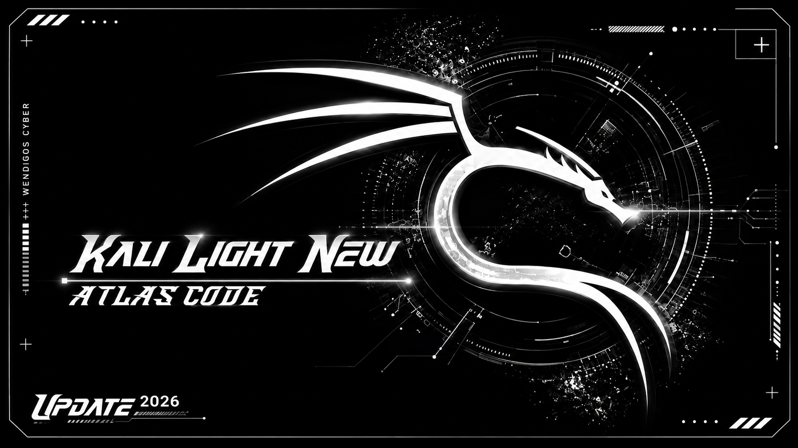
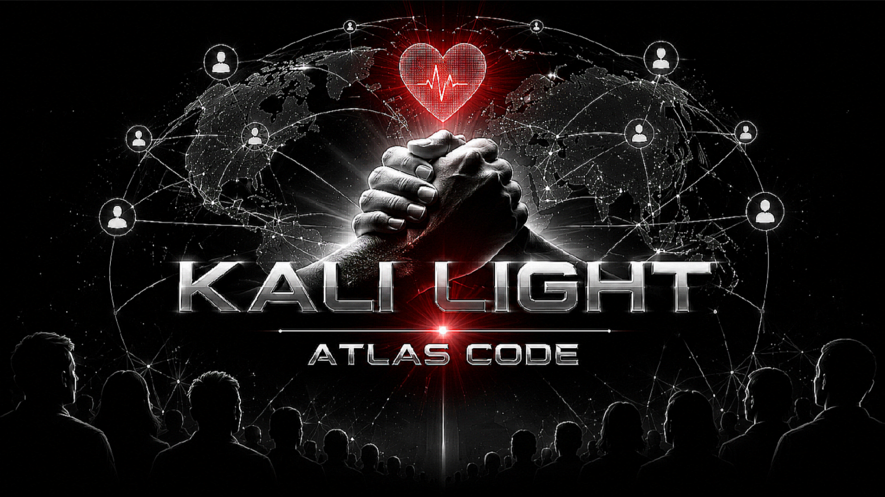

# Coming soon / LiGHTKALi (Kali Light)

# 🖥️ Kali Light

> **🇺🇸 English**  
> **Kali Light** is a lightweight, secure and developer-focused platform inspired by the Kali ecosystem. It provides a fast, modern environment for building, testing and publishing high-quality custom packages while maintaining a clean and professional user experience.

> **🇷🇺 Русский**  
> **Kali Light** — это лёгкая, безопасная и ориентированная на разработчиков платформа, предоставляющая современную среду для создания, тестирования и публикации качественных пользовательских пакетов.

> **🇮🇷 فارسی**  
> **Kali Light** یک بستر سبک، امن و توسعه‌محور است که امکانات لازم برای ساخت، آزمایش و انتشار پکیج‌های اختصاصی را در اختیار توسعه‌دهندگان قرار می‌دهد.

---

# ✨ About | О проекте | درباره پروژه

  

🇺🇸 **English**

Kali Light is designed to provide a clean, responsive and extensible development environment. The project focuses on performance, simplicity and a standardized package architecture for developers.

🇷🇺 **Русский**

Проект создан для обеспечения высокой производительности, простоты использования и единой архитектуры разработки пакетов.

🇮🇷 **فارسی**

هدف پروژه ایجاد محیطی سریع، ساده و قابل توسعه است تا توسعه‌دهندگان بتوانند پکیج‌های استاندارد و باکیفیت تولید کنند.

---

# 🚀 Features | Возможности | قابلیت‌ها

- ⚡ Lightweight & Fast • Лёгкий и быстрый • سبک و سریع
- 🔒 Secure Package Architecture • Безопасная архитектура • معماری امن
- 📦 Custom Package Development • Разработка пакетов • توسعه پکیج
- 🛠 Developer Toolkit • Инструменты разработчика • ابزارهای توسعه
- ⌨ Interactive Terminal Interface • Терминальный интерфейс • رابط ترمینالی
- 💾 Persistent Configuration • Сохранение настроек • ذخیره تنظیمات

---

# 👨‍💻 Developer Center

📍 **Developer Portal**

https://LiGHTKALi.github.io/developer

### Available Resources

- 📦 Package Documentation
- 🧪 Package Validator
- 📚 Development Guides
- 🔐 Package Policies
- 🚀 Publishing Workflow

---

# 🎯 Mission | Миссия | هدف پروژه

🇺🇸  
Create a lightweight and secure platform where developers can build reliable, maintainable and high-quality packages.

🇷🇺  
Создать лёгкую и безопасную платформу для разработки надёжных и качественных пакетов.

🇮🇷  
ایجاد بستری سبک، امن و استاندارد برای توسعه و انتشار پکیج‌های حرفه‌ای.

---

# 📄 License & Purchase

### 💼 Commercial License

https://LiGHTKALi.github.io/buy

### 📜 License Information

https://LiGHTKALi.github.io/license

---

# ❤️ Community

  

We welcome developers from all around the world.

Добро пожаловать разработчикам со всего мира.

از حضور توسعه‌دهندگان سراسر جهان استقبال می‌کنیم.

---

## 🌍 Languages

- 🇺🇸 English
- 🇷🇺 Русский
- 🇮🇷 فارسی

---

**Kali Light**

*Lightweight • Secure • Developer First*

**Made for Developers. Built for Quality.**

